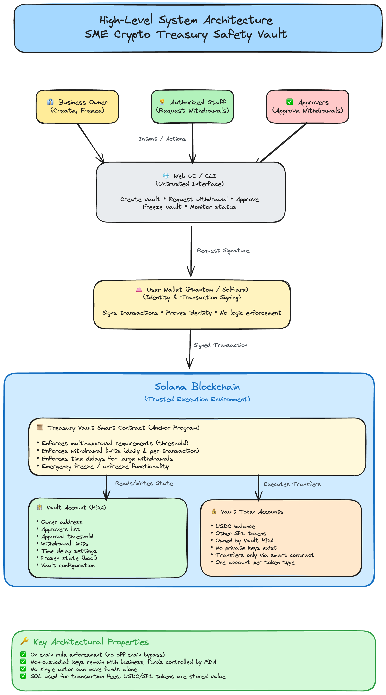
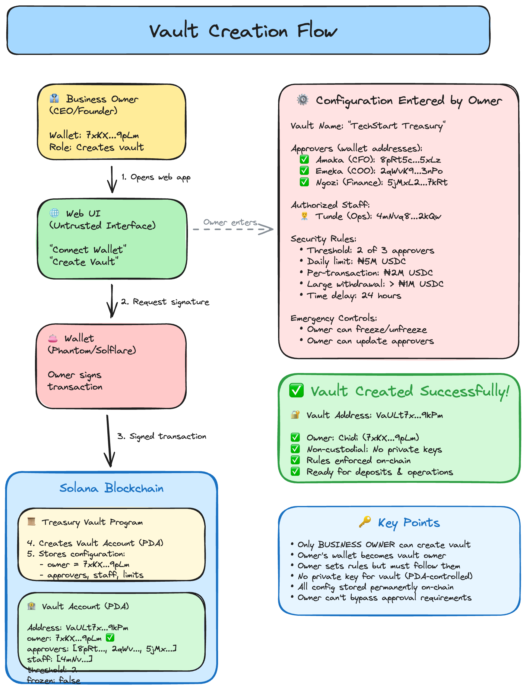
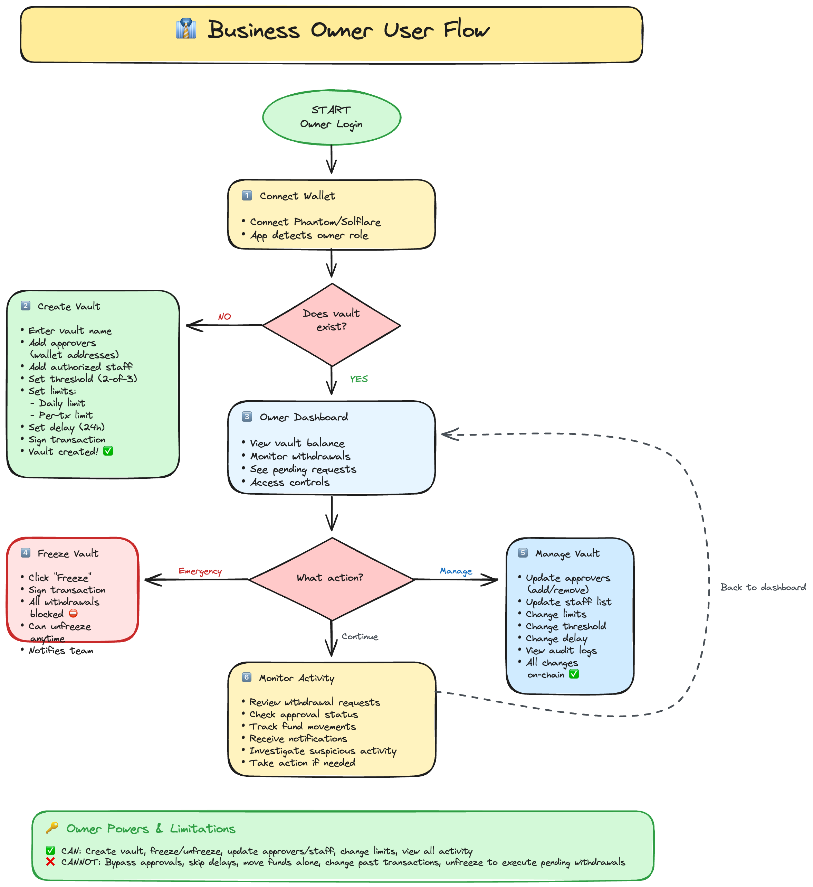
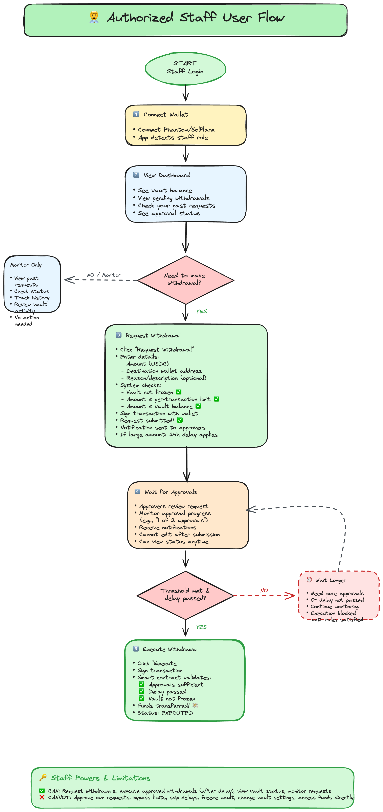
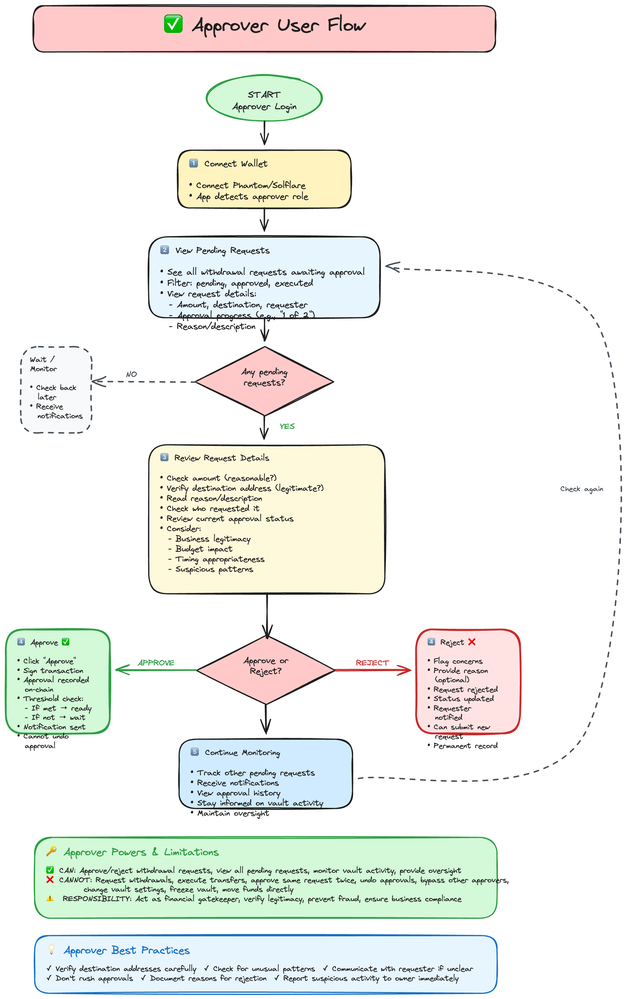

# SME Vault

Non-custodial, multi-signature crypto treasury management system built on Solana.

## Project Overview

SME Vault is a smart contract-based treasury management platform designed for small and medium enterprises (SMEs) managing cryptocurrency assets. It provides bank-level security controls through programmable on-chain rules, multi-signature approval workflows, and time-delayed execution for large withdrawals.

The system eliminates single points of failure in crypto asset management by enforcing role-based access control, approval thresholds, spending limits, and time delays—all enforced on-chain via Solana smart contracts. No third party can access funds; the business maintains full custody while benefiting from institutional-grade controls.

**Target users:** SMEs (10-500 employees) managing USDC and other SPL tokens, particularly those requiring approval workflows for operational spending, fraud prevention, and accountability.

**Core problem solved:** Traditional crypto wallets have no built-in approval processes, spending limits, or time delays. A single compromised key can drain funds instantly. SME Vault enforces programmable rules that cannot be bypassed, even by the vault owner.

## Tech Stack

### Blockchain Layer
- **Solana:** High-throughput L1 blockchain (low fees, sub-second finality)
- **Anchor Framework 0.31.1:** Rust-based smart contract framework
- **SPL Token Standard:** For USDC and other token support
- **Program Derived Addresses (PDAs):** Deterministic account generation without private keys

### Smart Contract (Rust)
- **Language:** Rust 2021 edition
- **Framework:** Anchor (macros for account validation, CPI, error handling)
- **Dependencies:**
  - `anchor-lang 0.31.1` — Core framework
  - `anchor-spl 0.31.1` — SPL token integration

### Testing & Tooling
- **Test Framework:** TypeScript + Mocha + Chai
- **Test Runner:** `ts-mocha` with Anchor test harness
- **Package Manager:** Yarn
- **Linter:** Prettier

### Build System
- **Cargo:** Rust build system with workspace configuration
- **Anchor CLI:** Build, test, and deploy commands
- **Release Profile:** Optimized with LTO and single codegen unit

**Why Solana?** Sub-second finality and $0.00025 transaction fees make it practical for frequent operational transactions (approvals, small withdrawals). Ethereum gas fees would make this prohibitively expensive for SME use cases.

**Why Anchor?** Provides security-focused account validation, automatic serialization, and idiomatic Rust patterns for Solana programs. Reduces boilerplate and common security pitfalls.

## Architecture & Design

### High-Level Architecture



The system consists of a Solana program managing vault and withdrawal request state through PDAs. Clients interact via RPC, submitting signed transactions that the program validates and executes.

### Vault Creation Flow



Owner creates a vault with configurable security parameters (approval threshold, limits, time delays). The vault PDA is derived deterministically from the owner's public key and vault name.

### User Role Flows

**Owner Flow:**


Owners manage vault configuration: adding/removing approvers and staff, adjusting limits, and freezing the vault in emergencies.

**Staff Flow:**


Staff members request withdrawals. The system validates amounts against configured limits and vault state before creating a pending request.

**Approver Flow:**


Approvers review and vote on pending requests. Once the approval threshold is met, the request becomes executable (subject to time delays for large amounts).

### Key Design Patterns

**1. Program Derived Addresses (PDAs) for Custody**

Vault PDAs own SPL token accounts. No private key exists for these addresses—only the smart contract can authorize transfers via CPI. This prevents any human from unilaterally moving funds.

**2. Role-Based Access Control (RBAC)**

Three distinct roles with separate permissions:
- **Owner:** Create vault, manage approvers/staff, freeze vault
- **Staff:** Request withdrawals
- **Approvers:** Approve/reject withdrawal requests

Permission checks occur on-chain in every instruction. UI cannot bypass these.

**3. Multi-Signature Approval Threshold**

Configurable M-of-N approval (e.g., 2-of-3). Withdrawals require threshold approvals before execution. Prevents single approver from authorizing transfers.

**4. Time-Delayed Execution**

Large withdrawals (above configurable threshold) require a time delay before execution. This creates a detection window for fraud. Even if threshold is met, execution is blocked until delay passes.

**5. Separation of Request/Approve/Execute**

Three distinct instruction calls:
1. `request_withdrawal` (staff) → creates pending request
2. `approve_withdrawal` (approvers) → adds approvals
3. `execute_withdrawal` (anyone) → performs token transfer

This creates natural checkpoints where fraud can be detected.

**6. Counter-Based PDA Derivation**

Withdrawal request PDAs use a counter seed: `["withdrawal", vault_pubkey, counter]`. This allows unlimited withdrawal requests per vault without seed collisions.

### Data Flow: Withdrawal Lifecycle

```
1. Staff member calls request_withdrawal()
   ├─ Validates: vault not frozen, amount within limits, requester is staff
   ├─ Creates WithdrawalRequest PDA (status: Pending)
   └─ If amount > large_withdrawal_threshold: sets delay_until timestamp

2. Approvers call approve_withdrawal()
   ├─ Validates: approver is in vault.approvers, not self-approval, not duplicate
   ├─ Adds approver to withdrawal.approvals[]
   ├─ If approvals.len() >= threshold: status = Approved
   └─ If large withdrawal: delay_until remains enforced

3. Anyone calls execute_withdrawal()
   ├─ Validates: status == Approved, approvals >= threshold
   ├─ Validates: if delay_until.is_some(), current_time >= delay_until
   ├─ Validates: vault not frozen, sufficient balance
   ├─ Executes SPL token transfer via CPI (vault PDA → destination)
   └─ Sets status = Executed, executed_at = current_timestamp
```

### Important Abstractions

**Vault Account** (`programs/sme-vault/src/state/vault.rs`)

Central authority object. Stores:
- Owner (Pubkey)
- Approvers list (max 10)
- Staff list (max 20)
- Approval threshold (M in M-of-N)
- Spending limits (daily, per-transaction, large withdrawal threshold)
- Time delay configuration (hours)
- Frozen flag (emergency stop)
- Withdrawal counter (for PDA derivation)

**WithdrawalRequest Account** (`programs/sme-vault/src/state/withdrawal_request.rs`)

Represents a single withdrawal request. Stores:
- Amount, destination, requester
- Approvals received (Vec<Pubkey>)
- Status enum (Pending/Approved/Executed/Rejected)
- Timestamps (created_at, delay_until, executed_at)

**Instruction Modules** (`programs/sme-vault/src/instructions/`)

Organized by domain:
- `approvers/` — add/remove approver instructions
- `staff/` — add/remove staff instructions
- `withdrawals/` — request/approve/execute withdrawal instructions
- `create_vault.rs` — vault initialization
- `initialize.rs` — program initialization (currently unused)

## Project Structure

```
sme-vault/                 # Anchor workspace root
├── programs/
│   └── sme-vault/
│       ├── src/
│       │   ├── lib.rs                     # Program entrypoint, instruction routing
│       │   ├── constants.rs               # Global constants (seeds, max values)
│       │   ├── error.rs                   # Custom error codes
│       │   ├── state/
│       │   │   ├── vault.rs               # Vault account definition
│       │   │   └── withdrawal_request.rs  # Withdrawal request account
│       │   └── instructions/
│       │       ├── initialize.rs          # (unused)
│       │       ├── create_vault.rs        # Vault creation
│       │       ├── approvers/
│       │       │   ├── add_approver.rs
│       │       │   └── remove_approver.rs
│       │       ├── staff/
│       │       │   ├── add_staff.rs
│       │       │   └── remove_staff.rs
│       │       └── withdrawals/
│       │           ├── request_withdrawal.rs
│       │           ├── approve_withdrawal.rs
│       │           └── execute_withdrawal.rs
│       ├── Cargo.toml                     # Program dependencies
│       └── Xargo.toml                     # Cross-compilation config
├── tests/                                 # TypeScript integration tests
│   ├── create-vault.ts
│   ├── add-approver.ts
│   ├── add-staff.ts
│   ├── request-withdrawal.ts
│   ├── approve-withdrawal.ts
│   └── execute-withdrawal.ts
├── migrations/                            # Anchor migration scripts (empty)
├── app/                                   # (placeholder for future frontend)
├── Anchor.toml                            # Anchor project config (cluster, wallet, scripts)
├── Cargo.toml                             # Workspace config
├── package.json                           # Test dependencies (TS, Mocha)
└── tsconfig.json                          # TypeScript config for tests

docs/                           # Project documentation
├── PROJECT_BRIEF.md            # Business requirements, user personas, roadmap
├── TODO_CHECKLIST.md           # Development checklist (Phases 1-5)
└── CODE_PATTERNS.md            # Coding standards, best practices, examples

diagrams/                       # Architecture diagrams (PNG)
├── high-level-architecture.png
├── vault-creation-flow.png
├── owner-user-flow.png
├── staff-user-flow.png
└── approver-user-flow.png

test-ledger/                    # Local validator ledger (gitignored)
.anchor/                        # Anchor build artifacts (gitignored)
```

**Key Directories:**
- `programs/sme-vault/src/instructions/` — All business logic lives here. Each instruction is a separate module with its handler function and account validation context.
- `programs/sme-vault/src/state/` — Account schemas. Use `#[derive(InitSpace)]` for automatic size calculation.
- `tests/` — Integration tests using Anchor's TypeScript client. Each test file covers one instruction.

**Non-Obvious Conventions:**
- Instruction handlers are defined in separate files but exposed via `mod.rs` aggregation.
- PDA seeds use static prefixes (`VAULT_SEED`, `WITHDRAWAL_SEED`) defined in `constants.rs`.
- All error codes are centralized in `error.rs` with descriptive messages.
- Withdrawal counter (`vault.withdrawal_count`) increments on each request to generate unique PDAs.

## Setup & Installation

### Prerequisites

**Required:**
- **Rust:** 1.75+ (`rustup install stable`)
- **Solana CLI:** 1.18+ ([solana.com/docs/intro/installation](https://solana.com/docs/intro/installation))
- **Anchor CLI:** 0.31.1 (`cargo install --git https://github.com/coral-xyz/anchor --tag v0.31.1 anchor-cli`)
- **Node.js:** 18+ (for tests)
- **Yarn:** 1.22+ (`npm install -g yarn`)

**Optional:**
- **solana-test-validator:** Included with Solana CLI (for local testing)

### Environment Variables

Create `.env` in `sme-vault/` (for frontend, when built):

```bash
# RPC endpoint
NEXT_PUBLIC_SOLANA_RPC_URL=https://api.devnet.solana.com
# Or localnet: http://127.0.0.1:8899

# Program ID (auto-generated on first deploy)
NEXT_PUBLIC_PROGRAM_ID=87oBsf59JzNKiCwqhpzKceYgJm1LnwPdnA3FxCE29D7p

# Cluster (localnet | devnet | mainnet-beta)
NEXT_PUBLIC_CLUSTER=localnet
```

**DO NOT commit:** Private keys, mainnet RPC URLs with auth tokens, production program IDs to public repos.

### Installation & Local Development

```bash
# 1. Clone repository
git clone <repo-url>
cd SME-vault/sme-vault

# 2. Install dependencies
yarn install

# 3. Build smart contract
anchor build

# 4. Start local validator (in separate terminal)
solana-test-validator

# 5. Configure Solana CLI to use localnet
solana config set --url localhost

# 6. Create a local keypair (if needed)
solana-keygen new --outfile ~/.config/solana/id.json

# 7. Airdrop SOL to your wallet (localnet only)
solana airdrop 10

# 8. Deploy program to localnet
anchor deploy

# 9. Run tests
anchor test --skip-local-validator  # If validator already running
# Or:
anchor test  # Starts validator, deploys, runs tests, shuts down
```

### Common Setup Pitfalls

**1. `anchor build` fails with "program not found"**

Ensure you're in the `sme-vault/` directory (where `Anchor.toml` lives), not the parent `SME-vault/` directory.

**2. `solana-test-validator` already running**

```bash
# Find and kill existing validator
pkill solana-test-validator
# Or use anchor test without --skip-local-validator (it manages lifecycle)
```

**3. Deployment fails with "account already in use"**

Program ID collision. Either:
- Delete `target/deploy/sme_vault-keypair.json` and rebuild (generates new ID)
- Or use `anchor upgrade` instead of `anchor deploy` (if intentionally redeploying)

**4. Tests fail with "Invalid account discriminator"**

Stale IDL. Rebuild and regenerate:

```bash
anchor build
anchor test
```

**5. Insufficient SOL for deployment**

Localnet: `solana airdrop 10`
Devnet: Use [solfaucet.com](https://solfaucet.com/) or `solana airdrop 2`

## Development Workflow

### Starting Development

```bash
# Terminal 1: Run local validator
solana-test-validator --reset  # --reset clears previous state

# Terminal 2: Watch mode (rebuilds on file change)
# Note: Anchor doesn't have built-in watch, use cargo-watch:
cargo install cargo-watch
cargo watch -x 'build-sbf'

# Terminal 3: Run tests
anchor test --skip-local-validator
```

### Key Commands

**Build:**
```bash
anchor build                    # Compile program + generate IDL
cargo build-sbf                 # Compile program only (faster)
```

**Test:**
```bash
anchor test                     # Full test suite (starts validator)
anchor test --skip-build        # Skip rebuild (faster iteration)
yarn run ts-mocha tests/*.ts    # Run specific test file
```

**Deploy:**
```bash
anchor deploy                   # Deploy to cluster in Anchor.toml
solana program deploy target/deploy/sme_vault.so  # Manual deploy
```

**Linting & Formatting:**
```bash
yarn lint                       # Check code formatting
yarn lint:fix                   # Auto-format TypeScript/JS files
cargo fmt                       # Format Rust code
cargo clippy                    # Rust linter
```

### Testing Workflow

Tests live in `tests/*.ts`. Each file tests one instruction:

```typescript
// tests/approve-withdrawal.ts
import * as anchor from "@coral-xyz/anchor";
import { Program } from "@coral-xyz/anchor";
import { SmeVault } from "../target/types/sme_vault";
import { expect } from "chai";

describe("approve_withdrawal", () => {
  const provider = anchor.AnchorProvider.env();
  anchor.setProvider(provider);
  const program = anchor.workspace.SmeVault as Program<SmeVault>;

  it("approves a withdrawal request", async () => {
    // Test implementation
  });

  it("rejects double approval", async () => {
    // Test implementation
  });
});
```

**Run specific test:**
```bash
yarn run ts-mocha -p ./tsconfig.json -t 1000000 tests/approve-withdrawal.ts
```

### Branching & Git Workflow

Current setup uses `main` branch. For team collaboration, adopt Git Flow:

```bash
# Feature development
git checkout -b feature/freeze-vault
# ... make changes ...
git commit -m "feat: implement freeze/unfreeze instructions"
git push origin feature/freeze-vault
# Create PR to main

# Hotfix
git checkout -b hotfix/approval-validation
# ... fix critical bug ...
git commit -m "fix: prevent self-approval bypass"
git push origin hotfix/approval-validation
# Create PR to main
```

## Key Features & Modules

### 1. Vault Creation & Management

**Location:** `programs/sme-vault/src/instructions/create_vault.rs`

**Purpose:** Initializes a treasury vault with configurable security parameters.

**Parameters:**
- `name` (String, max 50 chars): Human-readable vault identifier
- `approval_threshold` (u8): Minimum approvals required (M in M-of-N)
- `daily_limit` (u64): Maximum total withdrawals per 24 hours (in lamports)
- `tx_limit` (u64): Maximum per-transaction withdrawal amount
- `large_withdrawal_threshold` (u64): Amounts above this trigger time delay
- `delay_hours` (u64): Time delay duration for large withdrawals

**PDA Derivation:**
```rust
seeds = [b"vault", owner.key().as_ref(), name.as_bytes()]
```

**Modifying behavior:** To change vault creation logic, edit `create_vault.rs:handler()`. To add fields to vault state, update `state/vault.rs:Vault` struct and recalculate account size.

### 2. Role Management (Approvers & Staff)

**Location:**
- `programs/sme-vault/src/instructions/approvers/`
- `programs/sme-vault/src/instructions/staff/`

**Purpose:** Owner-only functions to add/remove users from role lists.

**Constraints:**
- Max 10 approvers (`MAX_APPROVERS` in `constants.rs`)
- Max 20 staff (`MAX_STAFF`)
- Prevents duplicates
- Validates threshold remains achievable when removing approvers

**Interaction:** Changes to these lists immediately affect permissions. Removing an approver mid-approval doesn't invalidate existing approvals on pending requests (design decision: approvals are immutable once granted).

**Modifying behavior:** To change max roles, edit `constants.rs`. To add role validation logic, edit handler functions in respective modules.

### 3. Withdrawal Request System

**Location:** `programs/sme-vault/src/instructions/withdrawals/request_withdrawal.rs`

**Purpose:** Staff members create withdrawal requests for approver review.

**Validation Checks:**
1. Signer is in `vault.staff`
2. Vault is not frozen (`vault.frozen == false`)
3. Amount > 0
4. Amount ≤ `vault.tx_limit`
5. (Future: check vault token balance)

**PDA Derivation:**
```rust
seeds = [
    b"withdrawal",
    vault.key().as_ref(),
    &vault.withdrawal_count.to_le_bytes()
]
```

Counter increments after each request, ensuring unique addresses.

**Time Delay Logic:**
```rust
if amount >= vault.large_withdrawal_threshold {
    withdrawal.delay_until = Some(current_time + (vault.delay_hours * 3600));
} else {
    withdrawal.delay_until = None;
}
```

**Modifying behavior:** To change validation logic, edit `request_withdrawal.rs:handler()`. To add fields (e.g., category, notes), update `WithdrawalRequest` struct and tests.

### 4. Approval Workflow

**Location:** `programs/sme-vault/src/instructions/withdrawals/approve_withdrawal.rs`

**Purpose:** Approvers vote on pending withdrawal requests.

**Validation Checks:**
1. Signer is in `vault.approvers`
2. Withdrawal status is `Pending`
3. Signer has not already approved (no double-voting)
4. Signer is not the requester (prevents self-approval)

**Threshold Logic:**
```rust
withdrawal.approvals.push(approver.key());

if withdrawal.approvals.len() >= vault.approval_threshold as usize {
    withdrawal.status = WithdrawalStatus::Approved;
    // If large withdrawal, delay_until remains enforced
}
```

**Modifying behavior:** To add approval comments, extend `WithdrawalRequest` with `approval_comments: Vec<String>` and pass comment as instruction argument.

### 5. Withdrawal Execution (Token Transfer)

**Location:** `programs/sme-vault/src/instructions/withdrawals/execute_withdrawal.rs`

**Purpose:** Performs the actual SPL token transfer after all checks pass.

**Validation Checks:**
1. Status is `Approved`
2. Vault is not frozen
3. `approvals.len() >= threshold` (redundant check for safety)
4. If `delay_until.is_some()`, current time ≥ delay timestamp
5. Vault token account balance ≥ withdrawal amount

**Token Transfer (CPI to SPL Token program):**
```rust
let cpi_ctx = CpiContext::new_with_signer(
    ctx.accounts.token_program.to_account_info(),
    Transfer {
        from: ctx.accounts.vault_token_account.to_account_info(),
        to: ctx.accounts.destination_token_account.to_account_info(),
        authority: ctx.accounts.vault.to_account_info(),
    },
    &[&[
        Vault::SEED_PREFIX,
        ctx.accounts.vault.owner.as_ref(),
        ctx.accounts.vault.name.as_bytes(),
        &[ctx.accounts.vault.bump],
    ]],
);
transfer(cpi_ctx, withdrawal.amount)?;
```

The PDA signer seeds authorize the vault PDA to sign the transfer.

**Modifying behavior:** To add execution fees, deduct a small amount before transfer and send to a fee collection account. Update `ExecuteWithdrawal` context to include fee account.

### 6. Freeze Mechanism (Future Feature)

**Status:** Not yet implemented (see `docs/TODO_CHECKLIST.md`).

**Design:** Owner-only instruction to set `vault.frozen = true`. All withdrawal-related instructions check this flag and fail with `VaultErrorCode::VaultFrozen` if frozen.

**Use case:** Emergency response to suspected fraud or compromised approver keys.

## Testing

### Test Strategy

**Approach:** Integration testing using Anchor's TypeScript test framework. Each test deploys the program to a local validator, creates test accounts, calls instructions, and asserts on-chain state changes.

**Philosophy:**
- Test realistic user flows, not isolated functions
- Validate both success paths and error conditions
- Ensure security constraints cannot be bypassed
- Test edge cases (exactly at limit, zero values, empty lists)

### Running Tests

```bash
# Full test suite (builds, deploys, runs all tests)
anchor test

# Skip rebuild (faster iteration during development)
anchor test --skip-build

# Skip validator management (if you have one running)
anchor test --skip-local-validator

# Run specific test file
yarn run ts-mocha -p ./tsconfig.json -t 1000000 tests/approve-withdrawal.ts
```

### Test Organization

Tests are located in `tests/`:

| File | Coverage |
|------|----------|
| `create-vault.ts` | Vault creation, validation |
| `add-approver.ts` | Add approver, duplicates, max limit |
| `remove-approver.ts` | Remove approver, threshold validation |
| `add-staff.ts` | Add staff, duplicates, max limit |
| `remove-staff.ts` | Remove staff |
| `request-withdrawal.ts` | Request creation, limit checks, frozen vault |
| `approve-withdrawal.ts` | Approval workflow, threshold logic, self-approval prevention |
| `execute-withdrawal.ts` | Token transfer, delay enforcement, balance checks |

### What Is Tested

**Positive Cases:**
- ✅ Vault creation with valid parameters
- ✅ Adding approvers and staff (up to limits)
- ✅ Requesting withdrawals within limits
- ✅ Multi-approver workflow (2-of-3, 3-of-5)
- ✅ Time delay calculation and enforcement
- ✅ Successful token transfer on execute
- ✅ Removing approvers/staff

**Negative Cases:**
- ✅ Non-owner cannot add approvers/staff
- ✅ Cannot add duplicate approvers/staff
- ✅ Cannot exceed max approvers (10) or staff (20)
- ✅ Non-staff cannot request withdrawals
- ✅ Withdrawal exceeding `tx_limit` rejected
- ✅ Non-approver cannot approve
- ✅ Self-approval rejected (requester cannot approve own request)
- ✅ Double approval by same approver rejected
- ✅ Execution before threshold met rejected
- ✅ Execution before delay passes rejected
- ✅ Execution when vault frozen rejected

### What Is NOT Covered

**Current gaps (as of Phase 1):**
- ❌ Daily limit enforcement (not implemented yet)
- ❌ Vault freeze/unfreeze instructions (not implemented)
- ❌ Concurrent request handling stress tests
- ❌ Token account balance validation edge cases
- ❌ Rejection workflow (`reject_withdrawal` instruction not implemented)
- ❌ Frontend integration tests
- ❌ Fuzz testing for input validation

**Future testing priorities:**
- Add daily spending limit tracking
- Test gas optimization (compute units)
- Audit external security review findings
- Load testing (100+ concurrent requests)

### Running Specific Test Scenarios

**Example: Test approval threshold edge cases**

```bash
# Run only approve-withdrawal tests
yarn run ts-mocha -p ./tsconfig.json -t 1000000 tests/approve-withdrawal.ts

# Grep for specific test
yarn run ts-mocha -p ./tsconfig.json -t 1000000 tests/approve-withdrawal.ts --grep "threshold met"
```

**Example: Debug failing test with verbose logs**

```bash
# Set Anchor log level
export ANCHOR_LOG=debug
anchor test --skip-build

# Or enable Solana RPC logs
solana logs  # In separate terminal
```

## Deployment

### Build Process

```bash
# 1. Clean previous builds
anchor clean

# 2. Build optimized program
anchor build

# 3. Verify program size (Solana has 10MB limit per program)
ls -lh target/deploy/sme_vault.so
# Should be ~500KB after optimization

# 4. Generate IDL (auto-generated by anchor build)
# Located at: target/idl/sme_vault.json

# 5. Run tests to verify build
anchor test --skip-build
```

### Environments

**Localnet (Development)**
- **RPC:** `http://127.0.0.1:8899`
- **Cluster:** `localnet`
- **Wallet:** `~/.config/solana/id.json`
- **Airdrop:** `solana airdrop 10`
- **Deploy:** `anchor deploy`

**Devnet (Staging)**
- **RPC:** `https://api.devnet.solana.com`
- **Cluster:** `devnet`
- **Wallet:** Same as localnet (or create dedicated devnet wallet)
- **Airdrop:** `solana airdrop 2` (limited to 2 SOL per request)
- **Deploy:**
  ```bash
  anchor build
  solana config set --url devnet
  anchor deploy
  # Note program ID and update Anchor.toml
  ```

**Mainnet-Beta (Production)**
- **RPC:** `https://api.mainnet-beta.solana.com` (or paid RPC like Helius, Triton)
- **Cluster:** `mainnet-beta`
- **Wallet:** **Hardware wallet required** (Ledger recommended)
- **Deploy:**
  ```bash
  anchor build
  solana config set --url mainnet-beta
  # AUDIT CODE FIRST
  anchor deploy --provider.wallet /path/to/mainnet/keypair.json
  # Verify deployment
  solana program show <PROGRAM_ID>
  ```

**⚠️ Mainnet Deployment Checklist:**
- [ ] External security audit completed
- [ ] All critical/high findings fixed
- [ ] Tests pass with 90%+ coverage
- [ ] Emergency pause mechanism tested
- [ ] Upgrade authority configured (or set to `None` for immutability)
- [ ] Program ID documented and backed up
- [ ] Upgrade authority keypair secured (hardware wallet + multisig)

### CI/CD

**Current:** Manual deployment only.

**Future CI/CD Pipeline (GitHub Actions):**

```yaml
# .github/workflows/deploy-devnet.yml
name: Deploy to Devnet
on:
  push:
    branches: [develop]

jobs:
  deploy:
    runs-on: ubuntu-latest
    steps:
      - uses: actions/checkout@v3
      - uses: actions-rs/toolchain@v1
        with:
          toolchain: stable
      - name: Install Solana
        run: sh -c "$(curl -sSfL https://release.solana.com/stable/install)"
      - name: Install Anchor
        run: cargo install --git https://github.com/coral-xyz/anchor --tag v0.31.1 anchor-cli
      - name: Build
        run: anchor build
      - name: Test
        run: anchor test --skip-deploy
      - name: Deploy to Devnet
        env:
          ANCHOR_WALLET: ${{ secrets.DEVNET_WALLET }}
        run: |
          solana config set --url devnet
          anchor deploy
```

## Known Trade-offs & Technical Decisions

### 1. Counter-Based vs Timestamp-Based Withdrawal PDAs

**Decision:** Use `vault.withdrawal_count` as PDA seed instead of timestamp.

**Rationale:**
- Counters guarantee uniqueness even with concurrent requests
- Timestamps could collide if two requests occur in same slot (~400ms)
- Counter enables sequential enumeration of all requests

**Trade-off:** Requires storing and incrementing counter in vault state. Adds 8 bytes to vault account and one extra write per request.

### 2. Approvals Stored as Vec<Pubkey> vs BitMap

**Decision:** Store approvals as `Vec<Pubkey>` in withdrawal request account.

**Rationale:**
- Simple to implement and debug
- Provides audit trail (who approved, in what order)
- Max 10 approvers → max 320 bytes (acceptable)

**Trade-off:** Less efficient than bitmap for large approver sets. If scaling to 100+ approvers, switch to bitmap representation.

### 3. No Daily Limit Tracking (Yet)

**Current State:** `daily_limit` field exists in vault but is not enforced.

**Reason:** Daily limit requires tracking 24-hour rolling windows or reset timestamps. Added complexity without MVP validation. Prioritized time delays over daily limits for initial security.

**Planned:** Phase 2 feature. Will store `daily_spent` and `daily_reset_at` in vault state, reset at UTC midnight.

### 4. Immutable Approvals

**Decision:** Approvals cannot be revoked once granted.

**Rationale:**
- Simplifies state management
- Prevents approval timing attacks (approve, execute, revoke before record)
- If approver realizes mistake, they don't approve subsequent requests

**Trade-off:** No "I changed my mind" option. Workaround: implement `reject_withdrawal` instruction (owner or approver can reject to prevent execution).

### 5. Anyone Can Execute Approved Withdrawals

**Decision:** `execute_withdrawal` doesn't check signer role (anyone can call).

**Rationale:**
- Execution is permissionless once all conditions met (threshold + delay)
- Allows automation/bots to execute on behalf of users
- Reduces coordination overhead ("who will click execute?")

**Trade-off:** Potential griefing vector (attacker executes before intended recipient ready). Mitigation: execution is idempotent; worst case is slightly earlier transfer.

### 6. No Partial Withdrawals or Cancellations

**Decision:** Withdrawal requests are all-or-nothing. No cancellation instruction.

**Rationale:** MVP simplicity. Partial withdrawals complicate accounting. Cancellation adds attack surface (race between cancel and execute).

**Workaround:** Create new request with correct amount. Old request expires after execution or remains `Pending` indefinitely (future: add expiration).

### 7. Solana Over Ethereum

**Decision:** Built on Solana, not EVM chains.

**Rationale:**
- Sub-second finality (better UX for approval workflows)
- ~$0.00025 per transaction (vs $5-50 on Ethereum L1)
- Native multisig via PDAs (no external multisig contract needed)

**Trade-off:** Smaller ecosystem, less liquidity, fewer institutional custodians integrate Solana. For target market (SMEs in emerging markets), cost and speed outweigh liquidity concerns.

## Future Improvements

### High Priority (Phase 2-3)

**1. Vault Freeze/Unfreeze Instructions**

Owner-only emergency stop mechanism. Blocks all withdrawals instantly.

**Implementation:** `freeze_vault.rs` and `unfreeze_vault.rs` instructions. Set `vault.frozen = true/false`.

**Estimated effort:** 1 day (instruction + tests)

---

**2. Daily Spending Limit Enforcement**

Track cumulative withdrawals in rolling 24-hour window.

**Implementation:**
```rust
pub struct Vault {
    // ... existing fields
    pub daily_spent: u64,
    pub daily_reset_at: i64,  // Unix timestamp
}
```

In `execute_withdrawal`, check:
```rust
if clock.unix_timestamp > vault.daily_reset_at {
    vault.daily_spent = 0;
    vault.daily_reset_at = clock.unix_timestamp + 86400;
}

require!(
    vault.daily_spent + withdrawal.amount <= vault.daily_limit,
    VaultErrorCode::DailyLimitExceeded
);

vault.daily_spent += withdrawal.amount;
```

**Estimated effort:** 2 days (state migration + logic + tests)

---

**3. Rejection Workflow**

Allow owner or approvers to reject pending requests.

**Implementation:** `reject_withdrawal.rs` instruction. Sets `status = Rejected`, preventing execution.

**Estimated effort:** 1 day

---

**4. Withdrawal Request Expiration**

Automatically expire requests after N days if not executed.

**Implementation:** Add `expires_at: i64` to `WithdrawalRequest`. Check in `execute_withdrawal`:
```rust
require!(
    clock.unix_timestamp <= withdrawal.expires_at,
    VaultErrorCode::RequestExpired
);
```

**Estimated effort:** 1 day

---

**5. Multi-Token Support**

Currently hardcoded for USDC. Generalize to any SPL token.

**Implementation:** Add `token_mint: Pubkey` to vault. Derive token account PDAs dynamically based on mint.

**Estimated effort:** 3 days (state changes + multiple token account handling + tests)

### Medium Priority (Phase 4)

**6. Approval Comments/Reasons**

Allow approvers to add notes when approving.

**Implementation:** `approval_comments: Vec<(Pubkey, String)>` in `WithdrawalRequest`.

**Estimated effort:** 2 days

---

**7. Batch Withdrawals**

Execute multiple approved requests in single transaction.

**Implementation:** New instruction `execute_batch_withdrawals` accepting `Vec<Pubkey>` of withdrawal PDAs.

**Estimated effort:** 3 days (compute budget optimization required)

---

**8. Vault Balance Tracking**

Store current balance in vault state to avoid extra RPC calls.

**Implementation:** Update balance in `create_vault` and `execute_withdrawal`. Requires listening to all token account changes (complex).

**Alternative:** Fetch balance from token account on-demand (current approach).

**Estimated effort:** 5 days (event listeners + sync logic)

### Low Priority / Long Term

**9. Recurring Payments**

Schedule automatic withdrawals (e.g., monthly payroll).

**10. Sub-Accounts / Budgets**

Allocate portions of vault to departments with separate limits.

**11. On-Chain Governance**

Allow approvers to vote on vault parameter changes (limits, threshold).

**12. Cross-Program Invocation (CPI) Support**

Allow other programs to request withdrawals (e.g., DeFi protocols auto-requesting rewards).

**13. Time-Locked Vesting**

Release funds gradually over time (employee vesting schedules).

## Troubleshooting & FAQ

### Build Issues

**Q: `anchor build` fails with "cannot find macro `declare_id`"**

A: Ensure `anchor-lang` dependency is present in `Cargo.toml`. Run `cargo update` and retry.

---

**Q: Build succeeds but program size is 10MB+**

A: Enable release optimizations in `Cargo.toml`:
```toml
[profile.release]
lto = "fat"
codegen-units = 1
```

### Deployment Issues

**Q: `anchor deploy` fails with "insufficient funds"**

A: Check wallet balance:
```bash
solana balance
# If < 5 SOL on localnet/devnet:
solana airdrop 5
```

---

**Q: Program deploys but tests fail with "Invalid instruction data"**

A: IDL out of sync. Rebuild and regenerate:
```bash
anchor clean
anchor build
anchor test
```

### Test Issues

**Q: Tests timeout after 60 seconds**

A: Increase timeout in test command:
```bash
yarn run ts-mocha -p ./tsconfig.json -t 1000000 tests/*.ts
```

Or set in test file:
```typescript
it("long running test", async function() {
  this.timeout(120000);  // 2 minutes
  // ...
});
```

---

**Q: Test fails with "Account does not exist"**

A: PDA derivation mismatch. Verify seeds in test match on-chain seeds:
```typescript
const [vaultPda, bump] = PublicKey.findProgramAddressSync(
  [
    Buffer.from("vault"),
    owner.publicKey.toBuffer(),
    Buffer.from(vaultName),
  ],
  program.programId
);
```

---

**Q: Random test failures on `anchor test`**

A: Race condition with validator startup. Use `--skip-build` or increase delay:
```typescript
await new Promise(resolve => setTimeout(resolve, 2000));
```

### Runtime Errors

**Q: Transaction fails with "custom program error: 0x1770"**

A: Anchor error code in hex. Decode:
```bash
# 0x1770 = 6000 in decimal
# Check error.rs: VaultErrorCode starts at 6000
```

Common codes:
- `6000` → `InvalidName`
- `6001` → `InvalidThreshold`
- `6002` → `InvalidLimit`
- `6003` → `Unauthorized`

---

**Q: "Transaction too large" error**

A: Exceeding 1232 byte packet limit. Reduce data in single transaction:
- Split multiple approver additions into separate transactions
- Use versioned transactions (v0) with address lookup tables

## Contributing

This is an academic capstone project. External contributions not currently accepted.

For future open-source release:
- Fork repository
- Create feature branch (`git checkout -b feature/amazing-feature`)
- Run tests (`anchor test`)
- Commit changes (`git commit -m 'feat: add amazing feature'`)
- Push branch (`git push origin feature/amazing-feature`)
- Open Pull Request

**Code Standards:**
- Follow patterns in `docs/CODE_PATTERNS.md`
- Run `cargo fmt` before committing Rust code
- Run `yarn lint:fix` before committing TypeScript
- Write tests for new instructions
- Update README if adding user-facing features

## License

ISC License (see `package.json`). Smart contract code available for inspection and educational use.

**Note:** Not audited for production use. Deploy at your own risk.

## Authors & Acknowledgments

**Primary Developer:** [Your Name/Team]

**Academic Institution:** [University Name]

**Project Type:** Undergraduate/Graduate Capstone Project

**Advisor:** [Advisor Name]

**Built With:**
- [Anchor Framework](https://github.com/coral-xyz/anchor) by Coral
- [Solana](https://solana.com/) blockchain
- [SPL Token Program](https://spl.solana.com/token) by Solana Labs

## Additional Resources

**Project Documentation:**
- [Project Brief](./docs/PROJECT_BRIEF.md) — Business requirements, user personas, market analysis
- [TODO Checklist](./docs/TODO_CHECKLIST.md) — Development roadmap (Phases 1-5)
- [Code Patterns](./docs/CODE_PATTERNS.md) — Coding standards and best practices
- [Architecture Diagrams](./diagrams/) — Visual system design

**External Resources:**
- [Anchor Book](https://book.anchor-lang.com/) — Official Anchor documentation
- [Solana Cookbook](https://solanacookbook.com/) — Code examples and patterns
- [Solana Program Library](https://spl.solana.com/) — SPL token documentation
- [Anchor Examples](https://github.com/coral-xyz/anchor/tree/master/tests) — Reference implementations

**Community:**
- [Solana Stack Exchange](https://solana.stackexchange.com/)
- [Anchor Discord](https://discord.gg/anchor)

---

**Project Status:** Phase 1 Complete (Smart Contracts) | Phase 2 Pending (Frontend)

**Last Updated:** December 2024

**Program ID (Localnet):** `87oBsf59JzNKiCwqhpzKceYgJm1LnwPdnA3FxCE29D7p`
